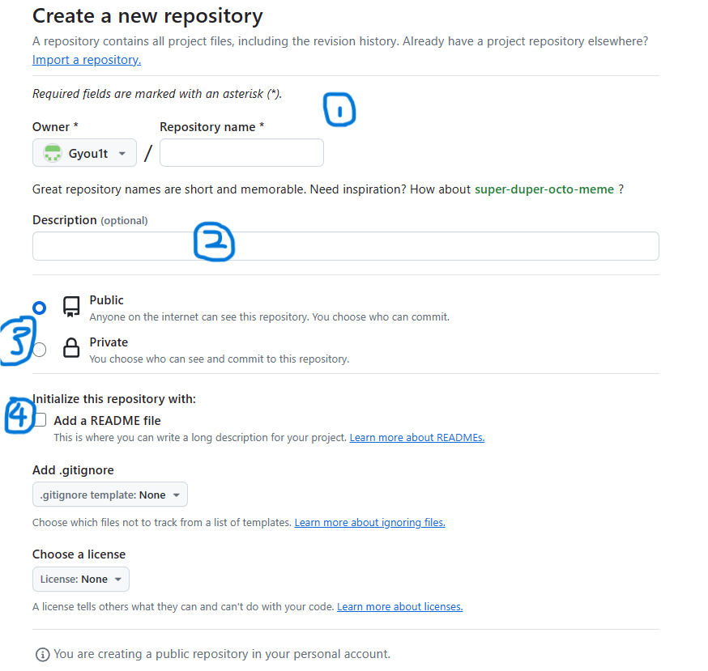
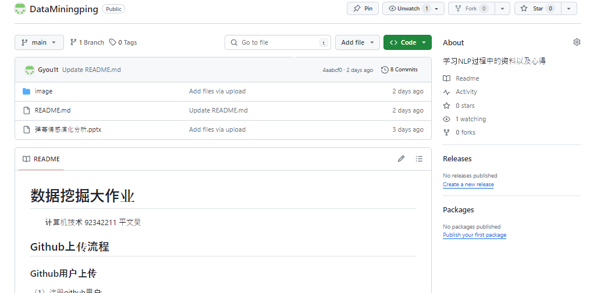

# 数据挖掘大作业
&emsp;&emsp;计算机技术 92342211 平文昊 
## Github上传流程
### Github用户上传
（1）注册github用户; 

&emsp;&emsp;首先进入Github网站（github.com或者百度Github），点击右上角sign up注册按钮； 

&emsp;&emsp;根据上述要求分别填写注册邮箱、密码和用户名。没输入完一步依次按照提示点击Continue即可。最后一项是否同意Github每次产品更新或者公告都发到邮箱，可以按照需求是否打勾。最后再次点击Continue。 

&emsp;&emsp;接下来会进行真人验证和邮箱验证。完成验证即可完成注册任务 

&emsp;&emsp;第一项是进行真人验证，检测是否是爬虫恶意注册。只需按照左图需求再右边找到匹配的图片即可。经过三次提交即可完成验证。也可以从下面选择音频验证和重新开始验证 

&emsp;&emsp;将邮箱收到的验证码填入框中即可验证注册的邮箱是你正在使用的由此便完成了注册的全部任务。 
&emsp;&emsp;由此以及完成注册，下面还有两个额外的可选项，可以根据需求选择跳过或填写 

&emsp;&emsp;第一项是你工作团队人数，第二项是你的身份。由此可以让Github指导你选择最适合你项目的工具 

&emsp;&emsp;仅有一项，你可以选择你感兴趣的工具，下面将详细介绍这些工具： 
* 协作编码:代码空间、拉取请求、通知、代码审查、代码审查分配、代码所有者、草案拉取请求、受保护分支等等。 
* 自动化和CI/CDActions，包，api, GitHub页面，GitHub市场，Webhooks，托管跑者，自托管跑者，秘密管理等。 
* 安全私有仓库，2FA，必需的审查，必需的状态检查，代码扫描，秘密扫描，依赖图，Dependabot警报等等。 
* 客户端AppsGitHub Mobile, GitHub CLI，和GitHub Desktop。 
* 项目管理项目、标签、里程碑、问题、统一贡献图、组织活动图、组织依赖关系洞察、回购洞察、维基和GitHub洞察。 
* 团队管理组织、邀请、团队同步、自定义角色、域验证、审计日志API、Repo创建限制和通知限制。 
* 社区GitHub市场，GitHub赞助商，GitHub技能和电子邮件。 
（2）仓库建立;  

&emsp;&emsp;注册后会直接来到个人账户的主页。点击左侧绿色的Create repository即可开始建立个人仓库。 

&emsp;&emsp;填写仓库信息。①号前面是仓库拥有用户后面是新建仓库的名字。②是你对仓库的描述。③是选择你的仓库是公开还是私有仅你自己可见。④可以给你的仓库添加配置文件（README、gitignore和license）。README是对你仓库的详细描述和一些运行须知。gitignore文件忽略一些特殊不需要或者不想add的文件。把要忽略的文件名填进去，Git就会自动忽略这些文件。lincense就是许可证。如果没有这个license，那么你的项目默认为独家版权，别人是不能碰你的项目的。只有当你创建了license，并在license之中声明了开源许可证之后，你的项目才是开源的。如果当前不进行选择，后续再上传到仓库也是可以的。如果选择后会根据内容进行初始化，readme文件默认是你之前填写的仓库描述。 
&emsp;&emsp;由此便完成了仓库的建立，可以进行后续的相关操作。 
（3）PPT上传; 

&emsp;&emsp;点击Add file。点击Upload file开始上传文件。 

&emsp;&emsp;上面可以直接拖拽想上传的文件或者点击路径再在电脑里选择，一次可以同时进行多个文件的上传。下面第一行可以填写仓库的相对路径（最下面可以选择根目录），第二行可以填写上传文件的描述。 

&emsp;&emsp;由此完成ppt上传 
（4）MarkDown文档记录; 
&emsp;&emsp;倘若建立仓库时勾选readme文档，可以在仓库中选择直接开始编辑。 

&emsp;&emsp;倘若没有勾选，点击Add file。点击Create new file开始编写markdwon文档。 

&emsp;&emsp;也可以先用latex编写markdown文档，然后再上传到仓库中 
&emsp;&emsp;倘若建立仓库时勾选readme文档，可以在仓库中选择直接开始编辑。 

&emsp;&emsp;倘若readme文档加载不出来图片或者仓库中的图片文件不能正确显示，则在ipaddress网站中搜索raw.githubusercontent.com 的ip并将其内容添加到C:\Windows\System32\drivers\etc路径下host文件如下图所示。 

## 学习技能
&emsp;&emsp;最想学习的内容是数据可视化。已经通过cs224n课程的学习以及深度学习的阅读了解了基本神经网络的发展历程和具体结构。但感觉对具体的实现和一些原理的理解并不深入。同时也有很多好奇，例如多注意力头所指词关心的其他词为什么在现实世界中存在语法练习。又比如卷积神经网络是如何通过过滤器筛选出文字的食物相关特征。想通过可视化更具体的看到词直接更加详细的联系，另一方面也想用图的方式将难以理解的内容转换成普通人更容易理解的行为。将通过陈为教授的《数据可视化》学习数据可视化的理论基础，了解数据可视化的基本概念、目的和原则。学习常见的可视化类型及其适用场景。并且尝试使用一些方法的组合设计出更合适的图像。掌握常用的数据可视化工具，学习使用Python的matplotlib和seaborn库进行数据可视化，掌握使用数据可视化工具创建基本图表和定制化图表的技能。更详细的还需要学习D3这种强大可视化工具，提升可视化能力。并在实际中尝试使用数据可视化例如分析数据集信息。阅读PyTorch等深度学习框架的源码，深入了解其内部实现。深入学习模型的底层实现原理，例如反向传播算法。学习理解深度学习框架的基本结构和工作流程。多读源码多动手，提升自己编码能力。
 

